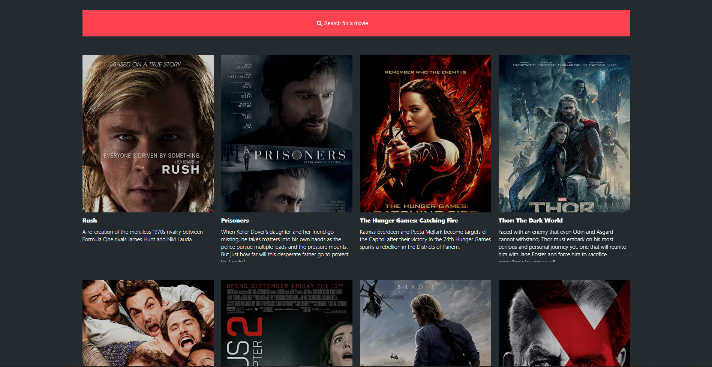

# Movies App

# 

A movie App with a search option, pagination and a splashscreen.
This project was made with react, styled components and typescript.

> Check it out: [https://flashcodx.github.io/movies-app/](https://flashcodx.github.io/movies-app/)

## Tech

- [React] - HTML enhanced for web apps!
- [Styled Components] - A CSS/JS framework for styling.
- [Vs Code] - A Great code Editor.
- [Typescript] - A javascript superset.
- CSS Grid
- CSS Flex
- API

## Installation

```sh
$ git clone https://github.com/FlashCodX/movies-app
$ cd movies-app
$ npm install
$ npm start
```

## License

MIT

**Free Software, Hell Yeah!**
[Styled Components]: https://styled-components.com/
[React]: <https://reactjs.org/>
[vs code]: https://code.visualstudio.com/
